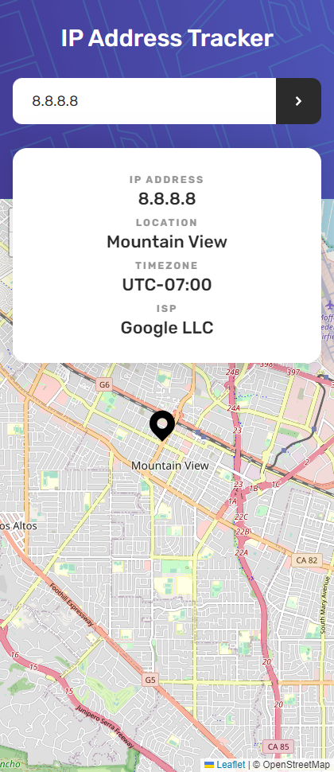
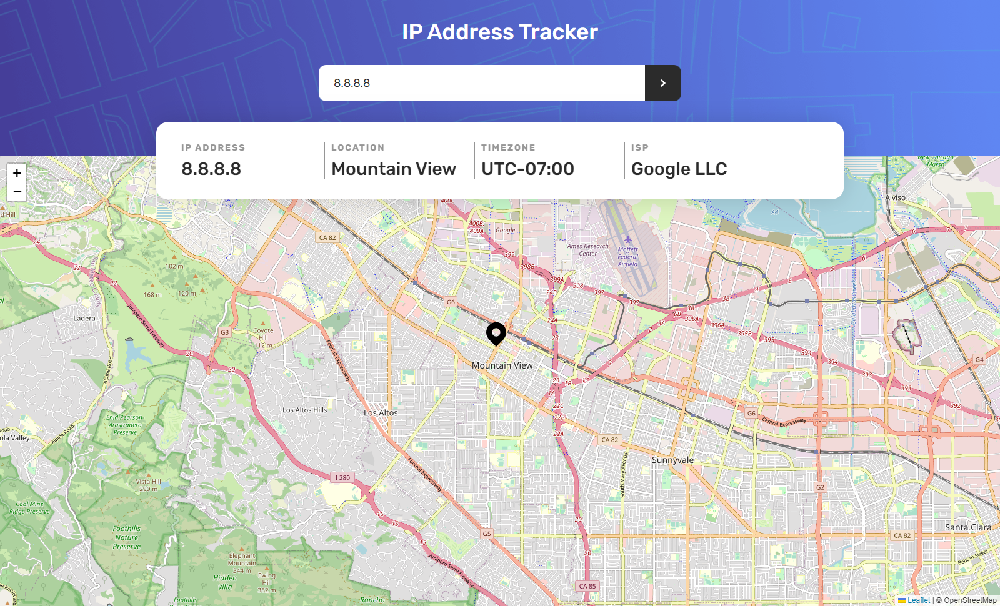

# Frontend Mentor - IP address tracker

## Welcome! 👋

This is a solution to the [IP address tracker challenge on Frontend Mentor](https://www.frontendmentor.io/challenges/ip-address-tracker-I8-0yYAH0).

[Frontend Mentor](https://www.frontendmentor.io) challenges help you improve your coding skills by building realistic projects.

## Table of contents

- [The challenge](#the-challenge)
- [Screenshot](#screenshot)
- [My process](#my-process)
- [Built with](#built-with)
- [Links](#links)
- [Author](#author)

## The challenge

The challenge is to build out this IP Address Tracker app and get it looking as close to the design as possible. To get the IP Address locations, you'll be using the [IP Geolocation API by IPify](https://geo.ipify.org/). To generate the map, we recommend using [LeafletJS](https://leafletjs.com/).

Your users should be able to:

- View the optimal layout for each page depending on their device's screen size
- See hover states for all interactive elements on the page
- See their own IP address on the map on the initial page load
- Search for any IP addresses or domains and see the key information and location

## Screenshot

This is the Screenshot of my work!

### Mobile

### Desktop

### Built with

- Semantic HTML5 markup
- SASS
- CSS custom properties
- Flexbox
- Mobile-first workflow
- NPM
- Vite
- [Vue Js](https://vuejs.org/)
- Vue Router
- Composition API
- Axios
- [LeafletJS](https://leafletjs.com/)
- [IP Geolocation API by IPify](https://geo.ipify.org/)

## My process

I made this projects with Vue js, Composition API and Vue Router. Used the _env Variables_ to store the API Key from [IP Geolocation API by IPify](https://geo.ipify.org/).IPify is used to get location from IP Address. Used [LeafletJS](https://leafletjs.com/) too, to show the map on search from the IP Address.

### Links

- Solution URL: [Add solution URL here](https://your-solution-url.com)
- Live Site URL: [Add live site URL here](https://your-live-site-url.com)

## Author

- GitHub - [Souleymane Sy](https://github.com/SouleymaneSy7)
- Frontend Mentor - [@SouleymaneSy7](https://www.frontendmentor.io/profile/SouleymaneSy7)
- Twitter - [@Souleymanesy43](https://twitter.com/Souleymanesy43)
